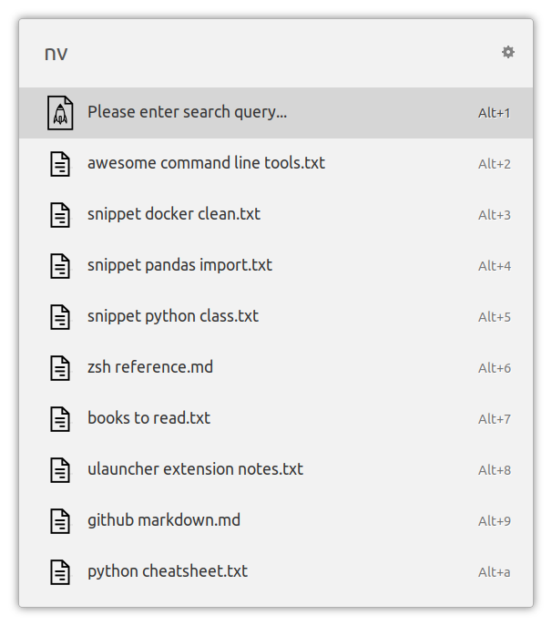
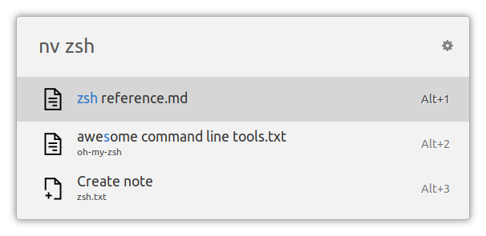
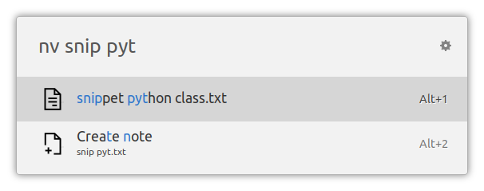
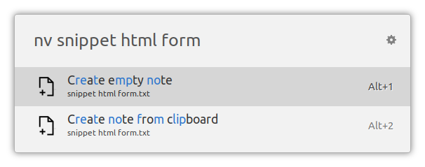
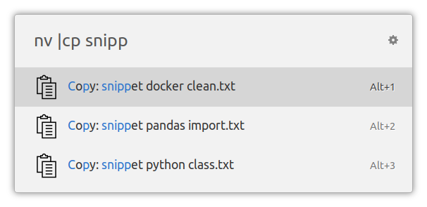
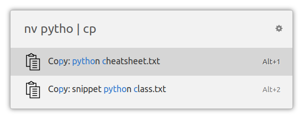

# ulauncher-notes-nv

A [NotationalVelocity](http://notational.net/)-inspired [Ulauncher](https://ulauncher.io/) extension for storing and retrieving notes as individual text files.


## Features

- Keyboard-centric search-first user experience: every action, including new note creation, begins with a search
- Intuitive fuzzy search of note titles and contents in Ulauncher
- *Plain text*: notes are stored as individual plain text files in a directory - use your favorite tools to keep them synchronized across devices
- *Bring Your Own Editor*: use your favorite editor to view and edit notes
- *Clipboard*: create notes from the contents of the clipboard, or copy the note contents into the clipboard directly from Ulauncher - useful for managing text snippets


## Usage

Open Ulauncher and type in "nv " to start the extension. If everything is configured correctly, you'll see a partial list of your notes files, most recently modified on top:



Start typing a search query to get instant search results. Select an note and press Enter to open it in the text editor that you configured in Preferences:



The more concrete the search, the smaller the list of search results:



Use the search query as a title of a new note. Decide whether you want an empty note or one with the contents of your clipboard and press Enter:




## Power user feature: commands

ulauncher-notes-nv allows you to perform simple operations on your notes using a "pipe to" syntax inspired by Unix command line:

### `cp`: Copy note to clipboard

Specifying `|cp` before or after the search pattern causes the selected note to be copied to the clipboard instead of being opened in a text editor:






## Installation

Open Ulauncher preferences window -> Extensions -> "Add extension" and paste the following url:

```
https://github.com/pbkhrv/ulauncher-notes-nv
```


## Configuration

- `Notes directory path`: path to where your notes files are stored.
- `Command to open note`: command to be executed to open the selected note file. Use the `{fn}` field to insert the full path to the note file. (If left empty, default application associated with that file type will be executed via `xdg-open`, e.g. default for `.txt` in Ubuntu is `gedit`)

Some examples of the "open note" terminal command:
```
gvim {fn}
```

```
gedit --new-document {fn}
```

```
gedit
```

(If you don't specify `{fn}`, the note file path will be automatically passed to the editor as the last argument.)


## Why?

NotationalVelocity is a Mac OS application with a cult following. [In its own words](http://notational.net):

> NOTATIONAL VELOCITY is an application that stores and retrieves notes.

> It is an attempt to loosen the mental blockages to recording information and to scrape away the tartar of convention that handicaps its retrieval. The solution is by nature nonconformist.

The "nonconformist" part is the one where NV ditched the traditional file-oriented actions of "create", "open" etc to reduce the number of steps required to store or access a piece of textual content:

> Searching for notes is not a separate action; rather, it is the primary interface.

> Searching encompasses all notes' content and occurs instantly with each key pressed.

> Notational Velocity's window was designed for keyboard input above all else, and thus has no buttons.

Ulauncher happens to share the search-centric design goals. The only thing it doesn't provide is a text editor, and the hope is that using an external editor won't detract from the overall user experience too much.


## Inspiration and thanks

I loved NotationalVelocity and its modern fork [NVAlt](https://brettterpstra.com/projects/nvalt/) on Mac OS, and I've been (largely unsuccessfully) searching for something as good on Linux for a while.